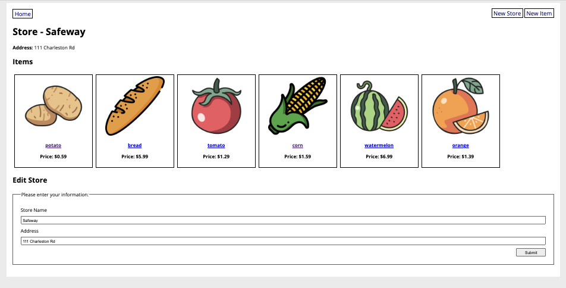

# Homework 3: Grocery Store

Web app that keeps track of grocery stores and the items they contain. Allows user to create and update stores and items. Allows users to create an account, login/logout, and add/remove items to a shopping list to make it easier to remember what they want to buy. Built using Flask, SQLAlchemy, and WTForms

# Run the server:

```
python3 app.py
```

# Screenshot:

